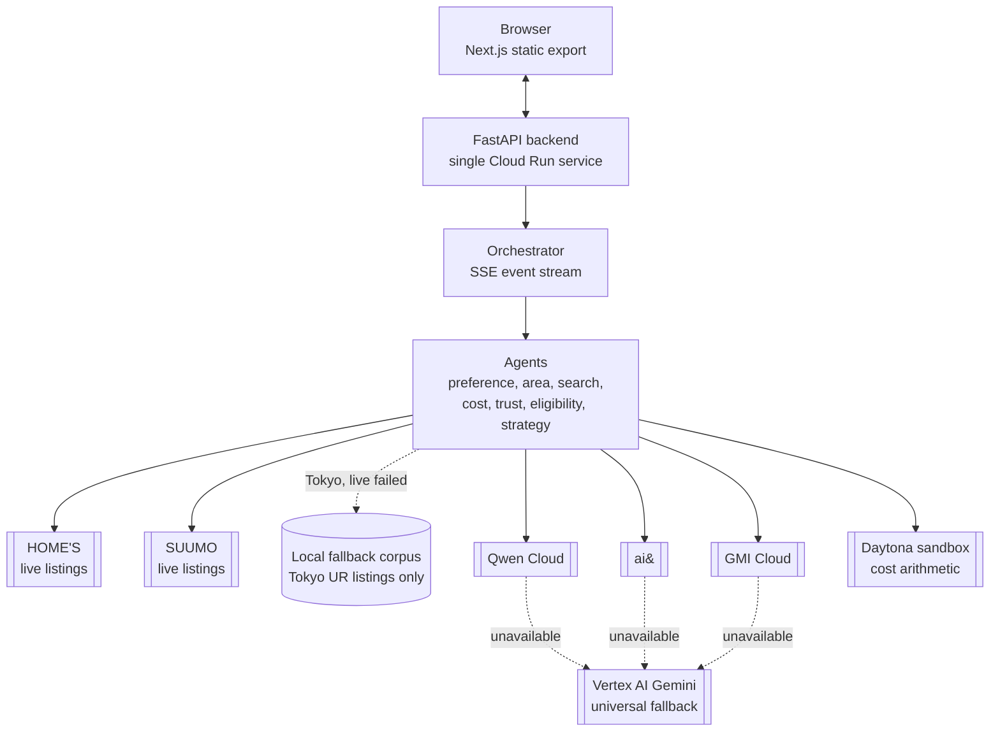
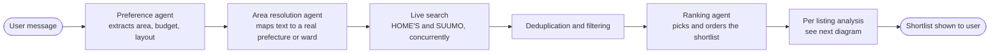
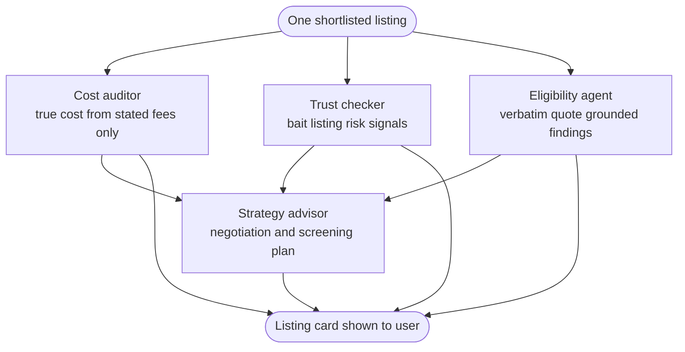
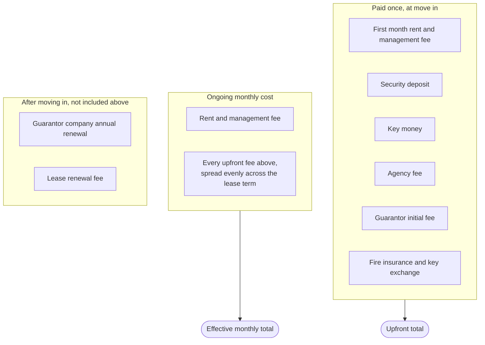
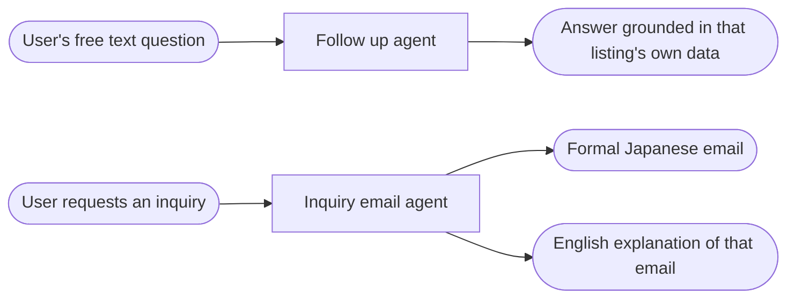

# Ekiden Architecture

Ekiden's own name is the Japanese word for a long distance relay race, and the system is built as one. No single agent covers the whole distance. Each stage hands structured output to the next, exactly like handing off a baton.

This document has three diagrams. The first shows the overall system. The second shows the main pipeline, from a user's message to a finished shortlist. The third zooms into how a single listing gets analyzed once it makes the shortlist.

## System overview

The frontend and backend live in one deployed service. The browser talks directly to the API, which streams results back as they become ready rather than waiting for the whole search to finish. Every model call in every agent has Vertex AI Gemini as a safety net, so one provider being unreachable never blanks the page.

## The main pipeline

If the area or the budget is still missing after the preference agent runs, the pipeline pauses and asks a clarifying question instead of guessing. A listing that violates a stated hard constraint, such as the wrong layout or a rent over budget, can never outrank one that satisfies every constraint. That guarantee is enforced in code after ranking, not left to the model's judgment.

## Per listing analysis

Three of the four agents run concurrently as soon as the listing is selected. The strategy advisor runs last on purpose. It needs the real cost gaps, the real trust signals, and the specific eligibility concerns before it can give advice that is actually grounded in that listing, rather than generic tips that could apply to any apartment.

## Cost breakdown, three separate additions

The true cost figure is the part of the product most likely to be misunderstood, so it is split into three parts that are each guaranteed to add up correctly rather than shown as one opaque number.

Any fee a listing does not explicitly state is excluded from every total here and disclosed separately, rather than filled in with a guessed average.

## Follow up features

The English text is always a gloss of the Japanese, never a substitute for it, since the Japanese body is what actually gets sent to the agency.
